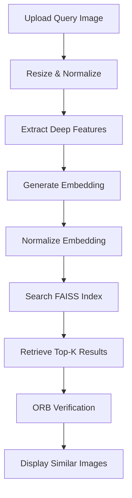
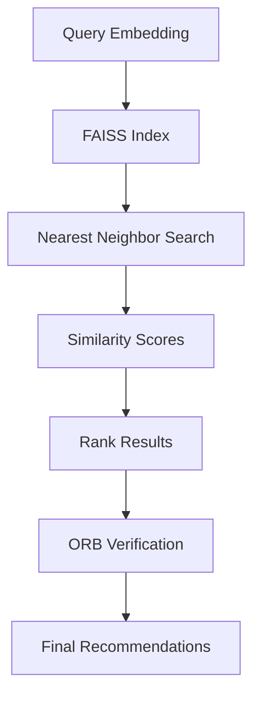
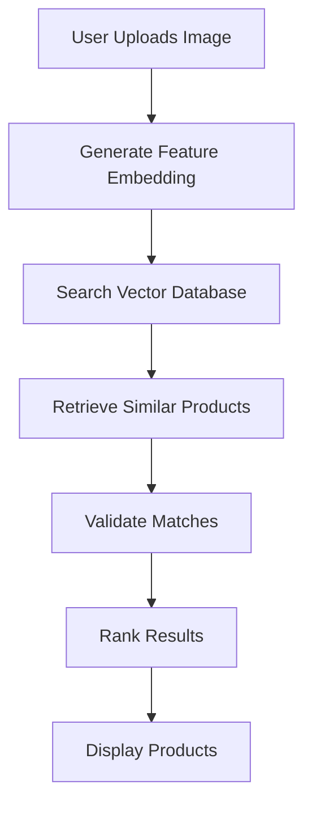
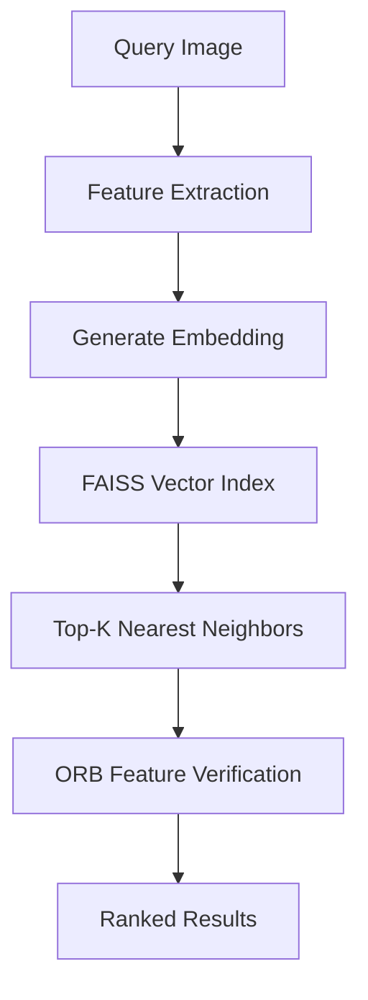

<div align="center">

# VisionSearch

### Deep Learning-Based Visual Search & Embedding Indexing Platform

A computer vision-powered visual search engine that retrieves visually similar fashion products using deep learning embeddings, vector similarity search, and feature matching. Instead of relying on text-based metadata, VisionSearch understands clothing through learned visual representations for fast and accurate image retrieval.

<br>


<br>

[]()
[]()
[](https://github.com/kavyyyaaa)

</div>

---

# About

VisionSearch is a deep learning-based visual product retrieval system that enables users to search for fashion products using images instead of keywords. The platform extracts semantic visual features from clothing images using a pre-trained ResNet-50 convolutional neural network and converts each image into a high-dimensional embedding vector.

To perform similarity search efficiently, the embeddings are indexed using Facebook AI Similarity Search (FAISS), allowing the system to retrieve visually similar products within milliseconds. An additional verification stage using OpenCV ORB feature matching improves retrieval quality by validating local image structures before displaying the final recommendations.

The application also includes an interactive visualization module that projects high-dimensional feature embeddings into a two-dimensional space using Principal Component Analysis (PCA), helping users understand how visually similar products are clustered.

---

# Key Features

| Feature | Description |
|----------|-------------|
| Image-Based Search | Retrieve visually similar fashion products using an input image |
| Deep Feature Extraction | Generate 2048-dimensional image embeddings using ResNet-50 |
| Vector Similarity Search | Fast nearest-neighbor retrieval powered by FAISS |
| ORB Verification | Validate retrieved images using local feature matching |
| PCA Visualization | Visualize image embeddings in an interactive 2D feature space |
| Similarity Ranking | Rank products according to embedding similarity scores |
| Performance Metrics | Display Top-1, Top-5, Precision@K, and Recall@K evaluation metrics |
| Interactive Dashboard | Clean web interface for image upload and result visualization |

---

# Table of Contents

- [About](#about)
- [Key Features](#key-features)
- [Application Preview](#application-preview)
- [Dashboard Overview](#dashboard-overview)
- [System Architecture](#system-architecture)
- [Visual Search Pipeline](#visual-search-pipeline)
- [Embedding Generation Workflow](#embedding-generation-workflow)
- [Technology Stack](#technology-stack)
- [Project Structure](#project-structure)
- [Installation](#installation)
- [Deep Learning Model](#deep-learning-model)
- [Performance Evaluation](#performance-evaluation)
- [Future Improvements](#future-improvements)
- [Contributing](#contributing)
- [License](#license)
- [Author](#author)

# Application Preview

## Home Interface

<p align="center">

</p>

The home interface provides a clean and intuitive environment where users can upload a query image and initiate a visual similarity search. The application is designed with a minimal user experience that focuses on fast image retrieval and seamless interaction.

---

## Search Results

<p align="center">

</p>

The retrieval engine returns the most visually similar products ranked according to feature embedding similarity. Each result represents a nearest neighbor in the learned feature space generated by the deep learning model.

---

## Embedding Visualization

<p align="center">

</p>

The embedding visualization projects high-dimensional image features into a two-dimensional space using Principal Component Analysis (PCA), allowing users to explore how visually similar products naturally cluster together.

---

## Performance Dashboard

<p align="center">

</p>

The evaluation dashboard summarizes retrieval performance through multiple metrics including Top-1 Accuracy, Top-5 Accuracy, Precision@K, and Recall@K.

---

# Dashboard Overview

The application is organized into multiple interconnected modules that work together to deliver accurate visual product retrieval.

| Module | Purpose |
|----------|---------|
| Image Upload | Upload a query image for similarity search |
| Feature Extraction | Generate deep feature embeddings using ResNet-50 |
| Vector Search | Retrieve nearest neighbors using FAISS |
| Feature Verification | Validate results using ORB feature matching |
| PCA Visualization | Display embedding distribution in 2D space |
| Evaluation Dashboard | Present retrieval performance metrics |
| Search Results | Display ranked visually similar products |

---

# System Architecture


The system follows a modular retrieval pipeline where each uploaded image is transformed into a semantic feature representation before performing similarity search through FAISS. Retrieved candidates are further validated using ORB feature matching to improve retrieval quality.

---

# Visual Search Pipeline



The visual search pipeline converts raw images into semantic embeddings before performing nearest-neighbor retrieval. Local feature verification improves ranking consistency and reduces false positives.

---

# Embedding Generation Workflow


Each image is represented as a compact numerical embedding capturing visual characteristics such as texture, color distribution, garment structure, and overall appearance. These embeddings form the searchable vector database used by the retrieval engine.

---

# Similarity Search Workflow



FAISS performs high-speed nearest-neighbor search within the embedding database, returning visually similar products ranked by cosine similarity. ORB feature matching provides an additional verification step before presenting the final recommendations.

---

# PCA Visualization Pipeline


Principal Component Analysis reduces the dimensionality of feature embeddings while preserving their relative distances, enabling intuitive visualization of product clusters and embedding relationships.

---

# Search Workflow



### Workflow Summary

1. The user uploads a query image.
2. The image is preprocessed and converted into a deep feature embedding.
3. The embedding is normalized and searched within the FAISS vector index.
4. The nearest neighbors are retrieved according to embedding similarity.
5. ORB feature matching verifies the retrieved candidates.
6. Products are ranked according to similarity scores.
7. PCA generates a visual representation of the embedding space.
8. The final ranked results and evaluation metrics are displayed through the web interface.

# Technology Stack

VisionSearch combines deep learning, computer vision, vector similarity search, and interactive visualization technologies to deliver a fast and scalable visual product retrieval system.

| Category | Technologies |
|----------|--------------|
| Programming Language | Python 3.x |
| Frontend | HTML5, CSS3, JavaScript |
| Backend Framework | Flask |
| Deep Learning | PyTorch, Torchvision |
| Computer Vision | OpenCV |
| Feature Extraction | ResNet-50 |
| Vector Search | FAISS |
| Numerical Computing | NumPy |
| Image Processing | Pillow |
| Data Visualization | Matplotlib, PCA |
| Development Tools | VS Code, Git, GitHub |

---

# Repository Structure

```text
VisionSearch/
│
├── app.py
├── requirements.txt
├── README.md
├── .gitignore
│
├── models/
│   └── resnet50_feature_extractor.py
│
├── embeddings/
│   ├── image_embeddings.npy
│   ├── image_paths.pkl
│   └── faiss_index.bin
│
├── dataset/
│   ├── shirts/
│   ├── dresses/
│   ├── jackets/
│   └── ...
│
├── static/
│   ├── css/
│   ├── js/
│   ├── uploads/
│   └── images/
│
├── templates/
│   └── index.html
│
├── utils/
│   ├── feature_extractor.py
│   ├── faiss_search.py
│   ├── orb_verification.py
│   ├── pca_visualizer.py
│   └── metrics.py
│
└── evaluation/
    ├── evaluate.py
    └── results.csv
```

---

# Installation

## Prerequisites

Before running the application, ensure you have the following installed:

- Python 3.10 or later
- Git
- pip
- Virtual Environment (recommended)

---

## Clone the Repository

```bash
git clone https://github.com/your-username/VisionSearch.git
```

Navigate to the project directory.

```bash
cd VisionSearch
```

---

## Create a Virtual Environment

Windows

```bash
python -m venv venv
```

Activate the environment.

Command Prompt

```bash
venv\Scripts\activate
```

PowerShell

```powershell
.\venv\Scripts\Activate.ps1
```

Linux / macOS

```bash
source venv/bin/activate
```

---

## Install Dependencies

```bash
pip install -r requirements.txt
```

---

# Running the Application

Start the Flask server.

```bash
python app.py
```

The application will start on:

```text
http://127.0.0.1:5000
```

Open the URL in your browser to access the visual search interface.

---

# API Endpoints

The application exposes the following endpoints.

| Method | Endpoint | Description |
|----------|----------|-------------|
| GET | `/` | Home page |
| POST | `/search` | Upload an image and retrieve similar products |
| GET | `/metrics` | Display retrieval evaluation metrics |
| GET | `/visualization` | View PCA embedding visualization |

---

## Example Search Request

```http
POST /search
Content-Type: multipart/form-data
```

Upload a query image through the form.

---

## Example Response

```json
{
  "query_image": "shirt.jpg",
  "results": [
    {
      "image": "shirt_12.jpg",
      "similarity": 0.97
    },
    {
      "image": "shirt_43.jpg",
      "similarity": 0.95
    },
    {
      "image": "shirt_18.jpg",
      "similarity": 0.94
    }
  ]
}
```

---

# Project Configuration

The application relies on the following resources during execution.

| Resource | Purpose |
|----------|----------|
| ResNet-50 | Deep feature extraction |
| FAISS Index | Fast nearest-neighbor search |
| Image Embeddings | Feature representation database |
| ORB Matcher | Local feature verification |
| PCA Module | Embedding visualization |
| Flask Server | Web application |

---

# Dataset

The project uses a curated fashion image dataset consisting of multiple clothing categories.

Example categories include:

- Shirts
- T-Shirts
- Dresses
- Jackets
- Hoodies
- Pants
- Shoes
- Accessories

Each image is converted into a high-dimensional feature embedding and stored inside the FAISS vector index for efficient similarity retrieval.

---

# Performance Evaluation

The retrieval engine is evaluated using standard information retrieval metrics.

| Metric | Description |
|----------|-------------|
| Top-1 Accuracy | Percentage of correct first predictions |
| Top-5 Accuracy | Percentage of correct predictions within the first five results |
| Precision@K | Relevance of retrieved products |
| Recall@K | Retrieval completeness |
| Cosine Similarity | Embedding similarity measurement |
| Retrieval Latency | Time required for nearest-neighbor search |

---

# Dependencies

Major libraries used in this project include:

- Flask
- PyTorch
- Torchvision
- OpenCV
- FAISS
- NumPy
- Pillow
- Matplotlib
- Scikit-learn

Install all dependencies using:

```bash
pip install -r requirements.txt
```

---

# Performance Highlights

| Capability | Description |
|------------|-------------|
| Feature Extraction | 2048-dimensional ResNet-50 embeddings |
| Vector Search | FAISS nearest-neighbor retrieval |
| Search Speed | Millisecond-level image retrieval |
| Verification | ORB feature matching |
| Visualization | PCA embedding projection |
| Evaluation | Top-1, Top-5, Precision@K, Recall@K |
| Architecture | Modular deep learning pipeline |

# Deep Learning Model

VisionSearch leverages a pre-trained **ResNet-50 Convolutional Neural Network** as its feature extraction backbone. Instead of performing image classification, the final fully connected layer is removed, allowing the network to generate a compact **2048-dimensional embedding** that captures the semantic characteristics of each fashion image.

These embeddings serve as numerical representations of visual attributes such as color, texture, shape, pattern, and garment structure, enabling efficient similarity search without relying on textual metadata.

---

## Feature Extraction Pipeline


---

## Similarity Search Pipeline



The generated embedding is searched against the FAISS vector database using nearest-neighbor search. Retrieved candidates are further refined using ORB feature matching, ensuring that the final recommendations preserve both global semantic similarity and local visual consistency.

---

## PCA Embedding Visualization


To improve interpretability, Principal Component Analysis (PCA) reduces high-dimensional embeddings into two dimensions, allowing users to visualize clusters of visually similar products within the embedding space.

---

## Model Specifications

| Component | Description |
|-----------|-------------|
| Backbone Network | ResNet-50 |
| Framework | PyTorch |
| Embedding Size | 2048 Dimensions |
| Similarity Search | FAISS |
| Feature Verification | OpenCV ORB |
| Distance Metric | Cosine Similarity |
| Visualization | PCA |
| Application | Visual Product Retrieval |

---

# Retrieval Workflow

The complete retrieval process consists of the following stages:

1. Upload a fashion image through the web interface.
2. Preprocess and normalize the image.
3. Extract a 2048-dimensional feature embedding using ResNet-50.
4. Normalize the embedding vector.
5. Search the FAISS index for the nearest neighbors.
6. Verify candidate matches using ORB feature descriptors.
7. Rank products based on similarity scores.
8. Display visually similar products along with evaluation metrics and embedding visualization.

---

# Future Improvements

The platform can be extended with several advanced capabilities:

- CLIP-based multimodal image retrieval
- Vision Transformer (ViT) feature extraction
- Approximate nearest-neighbor indexing using HNSW
- Hybrid image and text search
- Multi-object fashion detection
- Image segmentation for clothing isolation
- Personalized recommendation system
- Cloud deployment using Docker and Kubernetes
- Real-time recommendation API
- Mobile application support
- Support for larger-scale product catalogs
- User authentication and saved search history

---

# Contributing

Contributions are welcome.

If you would like to improve this project:

1. Fork the repository.
2. Create a new branch.

```bash
git checkout -b feature-name
```

3. Commit your changes.

```bash
git commit -m "Add new feature"
```

4. Push the branch.

```bash
git push origin feature-name
```

5. Open a Pull Request.

Please ensure that your contributions follow the existing project structure and coding conventions.

---

# License

This project is released for educational, research, and portfolio purposes.

You are free to use, modify, and extend the project with appropriate attribution.

---

# Author

<div align="center">

## Kavyaa Jaiswal

**B.Tech in Artificial Intelligence & Data Science**

Passionate about Artificial Intelligence, Computer Vision, Deep Learning, Machine Learning, and Intelligent Information Retrieval.

<br>

[](https://github.com/kavyyyaaa)

[](https://www.linkedin.com/in/kavyaa-jaiswal)

</div>

---

# Acknowledgements

This project was inspired by modern visual search systems and content-based image retrieval techniques. It combines deep learning, vector similarity search, and computer vision to demonstrate how semantic image representations can power efficient and scalable visual product discovery.

Special thanks to the open-source communities behind **PyTorch**, **FAISS**, **OpenCV**, **NumPy**, **Flask**, **Torchvision**, and **Pillow** for providing the tools and libraries that made this project possible.

---

<div align="center">

## Support

If you found this project useful, consider giving it a **Star** on GitHub.

Your support helps others discover the project and encourages continued development.

**Thank you for visiting!**

</div>


